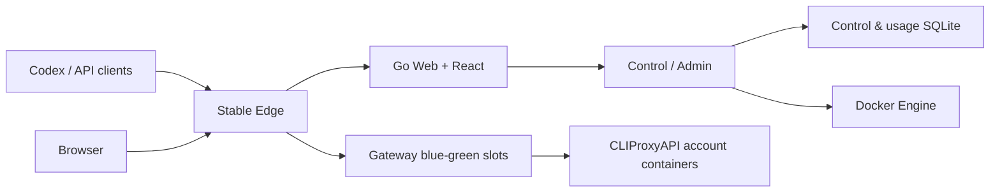

<div align="center">
  <picture>
    <source media="(prefers-color-scheme: dark)" srcset="./docs/assets/codex-cpa-cluster-mark-dark.svg">
    
  </picture>

  <h1>Codex CPA Cluster</h1>

  <p>
    Self-hosted multi-account CLIProxyAPI control plane, gateway and usage center.<br>
    <sub>自托管的多账号 CLIProxyAPI 控制平面、稳定网关与用量中心。</sub>
  </p>

  <p>
    <a href="./README.md">简体中文</a> · English
  </p>

  <p>
    <a href="https://github.com/Alfonsxh/codex-cpa-cluster/releases/latest"></a>
    <a href="https://github.com/Alfonsxh/codex-cpa-cluster/actions/workflows/ci.yml"></a>
    
    <a href="./LICENSE"></a>
  </p>

  
</div>

**CPAC** consolidates multiple [CLIProxyAPI](https://github.com/router-for-me/CLIProxyAPI) account containers behind a single stable endpoint. CLIProxyAPI wraps Codex, Claude, Gemini and other upstream accounts into an OpenAI-compatible API; without ever exposing upstream credentials, CPAC adds the multi-account governance, team sharing, and upgrade stability a single standalone instance lacks.

The typical users are **small businesses and teams**:

- Pool a handful of Codex accounts into one shared account pool;
- Issue each member an individual API key with its own weekly quota;
- Everyone keeps working in their own tools;
- The admin sees all members' usage and consumption trends in a single dashboard.

Individuals pooling personal accounts benefit just the same.

Admin and Web sit outside the model request data path, and existing SSE requests drain in their original slot during Gateway upgrades.

## Quick Start

Download the install script and run it — you can review the script before executing:

```sh
curl -fsSLO https://github.com/Alfonsxh/codex-cpa-cluster/releases/latest/download/run.sh
sudo sh run.sh
```

Or do it in a single line (the script never touches disk):

```sh
curl -fsSL https://github.com/Alfonsxh/codex-cpa-cluster/releases/latest/download/run.sh | sudo sh
```

**Requirements**:

- A Linux server with systemd enabled;
- `curl` and `sudo` installed;
- Missing dependencies are auto-installed via `apt-get` (i.e. Debian/Ubuntu family);
- A domain already resolved to the server.

**What the script does**:

- On first run it asks for your domain and an entry mode (reuse an existing reverse proxy, or let CPAC manage Nginx and HTTPS);
- Deploys the `control`, `web`, `gateway` and `edge` containers, then prints the admin URL and a one-time admin key;
- Re-running the same command later performs a safe upgrade: a consistent SQLite backup is taken first, and existing keys, OAuth state and routes are preserved.

**What it does not do**:

- Never installs, starts, or rewrites an Nginx or other reverse proxy you did not hand over to it;
- Never touches external proxy topology or the `/opt/cliproxyapi` systemd service.

**Version pinning** (`run.sh --tag`):

- `sudo /home/cpac/run.sh --tag` lists all GitHub Releases above the currently deployed version and upgrades to the one you pick in an interactive terminal; non-interactive environments only list candidates and never upgrade automatically;
- `sudo /home/cpac/run.sh --tag v2.0.0` pins or switches to a specific release;
- Tags only select the matching GitHub Release; orphan Git tags without complete release assets are not deployed.

The script and all previous versions are available on the [Releases](https://github.com/Alfonsxh/codex-cpa-cluster/releases/latest) page.

## Features

| Feature | Description |
| --- | --- |
| Multi-account management | Manage CPA accounts, OAuth authorization, runtime status and failover |
| Users and teams | Isolate external API keys from upstream internal keys; bind users, teams and accounts |
| Quota and usage | Collect request tokens, show per-account and per-user trends, enforce weekly quotas |
| Stable data plane | Fixed Edge entry, Gateway blue-green switching, SSE requests survive upgrades without interruption or replay |
| Safe upgrades | Consistent SQLite backups before upgrading, immutable image verification, keys/OAuth/routes preserved |
| Web management | Admin center, user portal, personal usage center and first-run setup |

<table>
  <tr>
    <td width="50%" align="center"><br><sub>Accounts</sub></td>
    <td width="50%" align="center"><br><sub>Usage</sub></td>
  </tr>
</table>

## Architecture



A production deployment consists of four immutable images:

- `control`: control plane — owns the control & usage SQLite databases and the account container lifecycle;
- `web`: Go Web + React admin and portal UI;
- `gateway`: model request data plane with blue-green slots;
- `edge`: fixed public entry aggregating browser and API traffic.

Control data and high-frequency usage are stored separately, and the Gateway only reads atomically published auth, quota and routing snapshots.

## Documentation

Full documentation is currently available in Chinese:

| Document | Contents |
| --- | --- |
| [Getting started](./docs/getting-started.md) | Dev dependencies, page preview, first admin setup, isolated testing |
| [Architecture](./docs/architecture.md) | Service topology, data ownership, request paths, blue-green switching |
| [Deployment](./docs/deployment.md) | Target prerequisites, release flow, entry configuration, acceptance |
| [Configuration center](./docs/configuration-center.md) | Email, quotas, notifications, branding, upstream proxies |
| [Upgrade](./docs/upgrade.md) | Backup, upgrade, acceptance and rollback boundaries |
| [Backup and restore](./docs/backup-and-restore.md) | SQLite, master key, OAuth and account config recovery |
| [Troubleshooting](./docs/troubleshooting.md) | Common deployment, gateway, account and usage issues |
| [Development](./docs/development.md) | Local development, verification toolchain, testing conventions |

## Local Development

```sh
npm ci --prefix frontend
npm ci --prefix tools/openapi
make verify
```

- React browser matrix: `npm --prefix frontend run test:e2e`;
- Isolated data plane drills (auth, model requests, SSE, faults, blue-green drain): `make test-build test-up test-smoke test-faults test-down`;
- See [CONTRIBUTING](./CONTRIBUTING.md) for the full workflow.

## Security

- Admin mounts the Docker socket to manage account containers — deploy on a trusted host and protect the admin entry point.
- Container health checks are no substitute for real API key acceptance tests covering non-streaming and SSE requests.
- When contributing, never commit API keys, OAuth files, webhooks, SQLite databases, logs, backups or runtime snapshots — see [CONTRIBUTING](./CONTRIBUTING.md).

Please report security vulnerabilities privately via [GitHub Private Vulnerability Reporting](https://github.com/Alfonsxh/codex-cpa-cluster/security/advisories/new); see [SECURITY.md](./SECURITY.md).

## License

Released under the [MIT License](./LICENSE).
