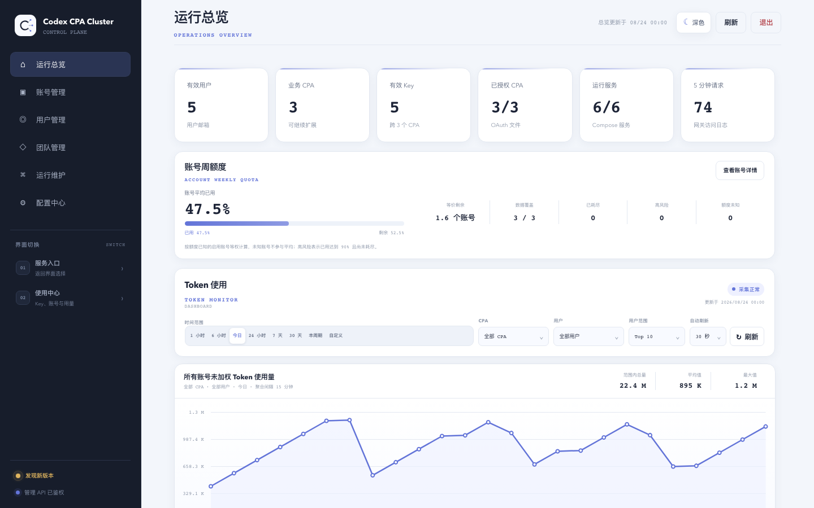
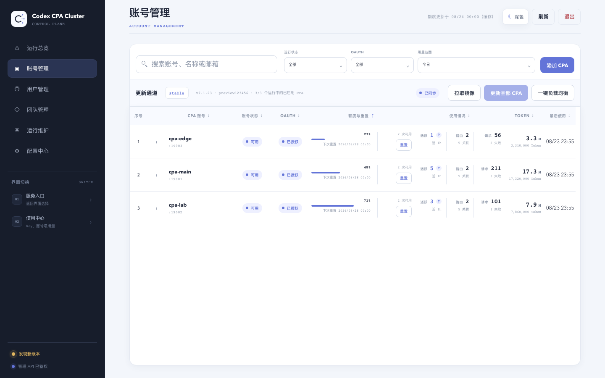
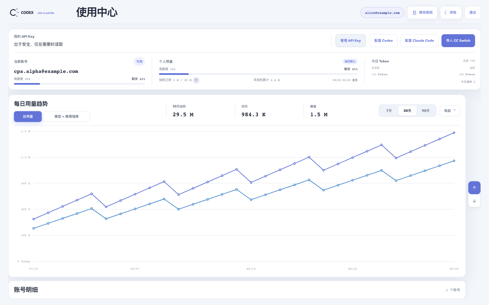
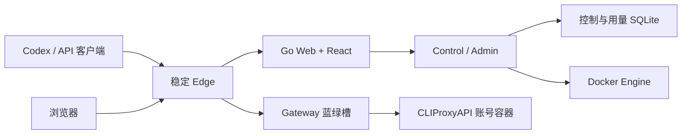

<div align="center">
  <picture>
    <source media="(prefers-color-scheme: dark)" srcset="./docs/assets/codex-cpa-cluster-mark-dark.svg">
    
  </picture>

  <h1>Codex CPA Cluster</h1>

  <p>
    自托管的多账号 CLIProxyAPI 控制平面、稳定网关与用量中心。<br>
    <sub>Self-hosted multi-account CLIProxyAPI control plane, gateway and usage center.</sub>
  </p>

  <p>
    简体中文 · <a href="./README.en.md">English</a>
  </p>

  <p>
    <a href="https://github.com/Alfonsxh/codex-cpa-cluster/releases/latest"></a>
    <a href="https://github.com/Alfonsxh/codex-cpa-cluster/actions/workflows/ci.yml"></a>
    
    <a href="./LICENSE"></a>
  </p>

  <p>
    <a href="#quick-start">快速开始</a> ·
    <a href="#features">核心能力</a> ·
    <a href="#architecture">运行架构</a> ·
    <a href="#documentation">文档</a> ·
    <a href="./CONTRIBUTING.md">参与贡献</a>
  </p>

  
</div>

**CPAC** 将多个 [CLIProxyAPI](https://github.com/router-for-me/CLIProxyAPI) 账号容器收敛到一个稳定入口。CLIProxyAPI 负责把 Codex、Claude、Gemini 等上游账号封装为 OpenAI 兼容 API；CPAC 在不暴露上游凭据的前提下，补齐它单机运行时缺失的多账号治理、团队共享与升级稳定性。

**典型用户是小企业和小团队**，典型用法是：

- 把若干个 Codex 账号集中托管为一个共享账号池；
- 为每位成员发放独立 API Key，并分配周额度；
- 成员照常在自己的工具里接入使用；
- 管理者在一个面板里查看所有成员的用量与消耗趋势。

个人聚合多账号同样适用。

Admin 与 Web 不在模型请求数据路径上，Gateway 升级时已有 SSE 请求会留在原槽排空。

<a id="quick-start"></a>

## 快速开始

下载安装脚本并执行，运行前可以先检查脚本内容：

```sh
curl -fsSLO https://github.com/Alfonsxh/codex-cpa-cluster/releases/latest/download/run.sh
sudo sh run.sh
```

也可以一行直接完成（脚本不落盘）：

```sh
curl -fsSL https://github.com/Alfonsxh/codex-cpa-cluster/releases/latest/download/run.sh | sudo sh
```

**环境要求**：

- 启用 systemd 的 Linux 服务器；
- 已安装 `curl` 和 `sudo`；
- 缺少依赖时脚本可通过 `apt-get` 自动安装，即 Debian/Ubuntu 系；
- 一个已解析到该服务器的域名。

**脚本会做什么**：

- 首次运行引导你输入域名，并选择入口模式（复用现有反向代理，或由 CPAC 托管 Nginx 与 HTTPS）；
- 部署 `control`、`web`、`gateway`、`edge` 四类容器，完成后输出管理员登录地址和仅出现一次的管理密钥；
- 之后任何时候再次执行同一条命令即为安全升级：升级前自动生成一致性 SQLite 备份，保留现有 Key、OAuth 和路由。

**它不会做什么**：

- 不安装、不启动、不改写你未交给它管理的 Nginx 或其他反向代理站点；
- 不触碰外部代理拓扑或 `/opt/cliproxyapi` 系统服务。

**版本选择**（`run.sh --tag`）：

- `sudo /home/cpac/run.sh --tag`：列出所有高于当前部署版本的 GitHub Releases，在交互终端中选择后升级；非交互环境只展示候选版本，不会自动升级；
- `sudo /home/cpac/run.sh --tag v2.0.0`：固定或切换到指定 Release；
- Tag 只用于选择对应的 GitHub Release，缺少完整 Release 附件的孤立 Git Tag 不会被部署。

脚本与历史版本均可在 [Releases](https://github.com/Alfonsxh/codex-cpa-cluster/releases/latest) 页面获取。完整前置条件与验收步骤见[部署文档](./docs/deployment.md)。

<a id="features"></a>

## 核心能力

| 能力 | 说明 |
| --- | --- |
| 多账号管理 | 管理 CPA 账号、OAuth 授权、运行状态与故障迁移 |
| 用户与团队 | 隔离外部 API Key 和上游内部 Key，支持用户、团队和账号绑定 |
| 额度与用量 | 采集请求 Token，展示账号及用户趋势，并执行周额度策略 |
| 稳定数据面 | Edge 固定入口，Gateway 蓝绿切换，已有 SSE 请求不中断、不重放 |
| 安全升级 | 升级前生成一致性 SQLite 备份，校验不可变镜像并保留现有 Key、OAuth 和路由 |
| Web 管理 | 提供管理中心、用户 Portal、个人使用中心和首次配置流程 |

<table>
  <tr>
    <td width="50%" align="center"><br><sub>账号管理</sub></td>
    <td width="50%" align="center"><br><sub>用量分析</sub></td>
  </tr>
</table>

<a id="architecture"></a>

## 运行架构



正式部署由四类不可变镜像组成：

- `control`：控制面，读写控制与用量 SQLite，管理账号容器生命周期；
- `web`：Go Web + React 管理与门户界面；
- `gateway`：模型请求数据面，蓝绿双槽切换；
- `edge`：固定公网入口，聚合浏览器与 API 流量。

控制数据与高频用量分别存储，Gateway 只读取原子发布的鉴权、额度和路由快照。完整设计见[架构文档](./docs/architecture.md)。

## 入口模式

| 模式 | 适用场景 | 脚本行为 |
| --- | --- | --- |
| 使用现有反向代理 | 已有 Nginx、Caddy、Traefik 或统一网关 | 不安装、不启动、不修改 Nginx/Certbot；输出反向代理要求 |
| CPAC 托管 | 全新服务器，希望自动配置公网 HTTPS | 按需安装 Nginx/Certbot，创建 CPAC 专属站点并申请证书 |

- 入口模式只在首次安装时选择；
- 后续升级复用已有设置；
- 不会静默接管或改写现有站点。

<a id="documentation"></a>

## 文档

| 文档 | 内容 |
| --- | --- |
| [快速开始](./docs/getting-started.md) | 开发依赖、页面预览、首次管理员设置和隔离测试 |
| [架构](./docs/architecture.md) | 服务拓扑、数据所有权、请求链路与蓝绿切换 |
| [部署](./docs/deployment.md) | 目标前置条件、发布流程、入口配置与上线验收 |
| [配置中心](./docs/configuration-center.md) | 邮箱、额度、通知、品牌和上游代理配置 |
| [升级](./docs/upgrade.md) | 备份、升级、验收与回滚边界 |
| [备份与恢复](./docs/backup-and-restore.md) | SQLite、主密钥、OAuth 和账号配置恢复 |
| [故障排查](./docs/troubleshooting.md) | 常见部署、网关、账号和用量问题 |
| [开发指南](./docs/development.md) | 本地开发、验证工具链与测试约定 |
| [更新日志](./CHANGELOG.md) | 面向使用者的版本变更记录 |

## 本地开发

```sh
npm ci --prefix frontend
npm ci --prefix tools/openapi
make verify
```

- React 浏览器矩阵：`npm --prefix frontend run test:e2e`；
- 隔离数据面演练（鉴权、模型请求、SSE、故障和蓝绿排空）：`make test-build test-up test-smoke test-faults test-down`；
- 详细流程见[贡献指南](./CONTRIBUTING.md)。

## 安全

- Admin 挂载 Docker Socket 管理账号容器，请部署在可信主机并保护好管理入口。
- 容器健康检查不能替代真实 API Key 的非流式和 SSE 业务验收。
- 向本仓库贡献代码时，不要提交 API Key、OAuth、Webhook、SQLite、日志、备份或运行快照，完整要求见[贡献指南](./CONTRIBUTING.md)。

安全漏洞请通过 [GitHub Private Vulnerability Reporting](https://github.com/Alfonsxh/codex-cpa-cluster/security/advisories/new) 私下报告，详见[安全策略](./SECURITY.md)。

## License

本项目基于 [MIT License](./LICENSE) 发布。
