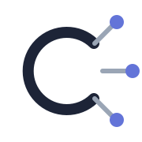
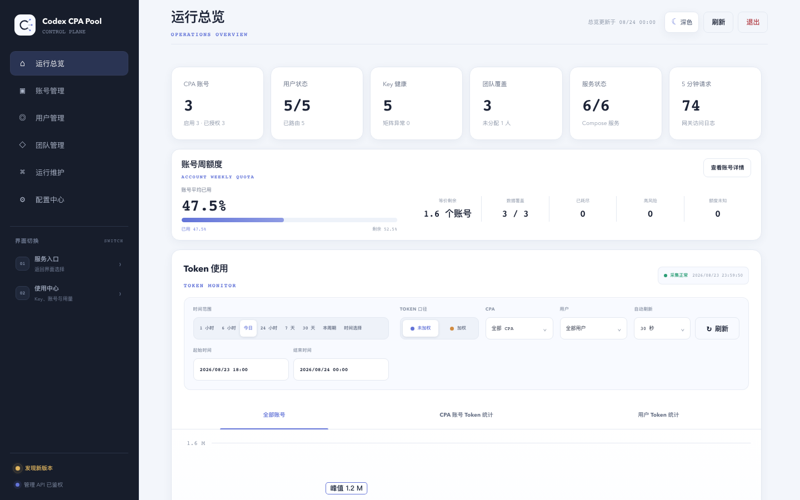
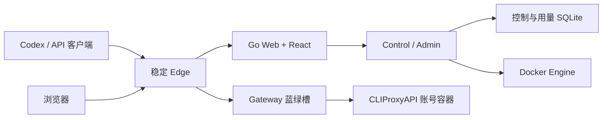

<p align="center">
  <picture>
    <source media="(prefers-color-scheme: dark)" srcset="./frontend/portal/public/assets/codex-cpa-cluster-mark-dark.svg">
    <source media="(prefers-color-scheme: light)" srcset="./frontend/portal/public/assets/codex-cpa-cluster-mark.svg">
    
  </picture>
</p>

<h1 align="center">Codex CPA Cluster</h1>

<p align="center">
  自托管的多账号 CLIProxyAPI 控制平面、稳定网关与用量中心。
  <br>
  <sub>Self-hosted multi-account CLIProxyAPI control plane, gateway and usage center.</sub>
</p>

<p align="center">
  <a href="https://github.com/Alfonsxh/codex-cpa-cluster/releases/latest"></a>
  <a href="https://github.com/Alfonsxh/codex-cpa-cluster/actions/workflows/ci.yml"></a>
  <a href="./LICENSE"></a>
</p>

<p align="center">
  <a href="#快速开始">快速开始</a> ·
  <a href="#核心能力">核心能力</a> ·
  <a href="#运行架构">运行架构</a> ·
  <a href="#文档">文档</a> ·
  <a href="./CONTRIBUTING.md">参与贡献</a>
</p>

<p align="center">
  <picture>
    <source media="(prefers-color-scheme: dark)" srcset="./frontend/e2e/visual.spec.ts-snapshots/react-overview-desktop-dark-darwin.png">
    <source media="(prefers-color-scheme: light)" srcset="./frontend/e2e/visual.spec.ts-snapshots/react-overview-desktop-light-darwin.png">
    
  </picture>
</p>

CPAC 将多个 CLIProxyAPI 账号容器收敛到一个稳定入口，在不暴露上游凭据的前提下，为团队提供账号路由、用户 API Key、额度控制、用量分析和日常运维。Admin 与 Web 不在模型请求数据路径上，Gateway 升级时已有 SSE 请求会留在原槽排空。

## 快速开始

准备一台具备 `curl`、`sudo` 和 systemd 的 Linux 服务器，并将访问域名解析到该服务器；缺少依赖时的自动安装目前要求 `apt-get`。首次安装和以后升级都执行同一条命令：

```sh
curl -fsSL https://github.com/Alfonsxh/codex-cpa-cluster/releases/latest/download/run.sh | sudo sh
```

首次运行会引导你输入域名，并选择复用现有反向代理，或由 CPAC 配置 Nginx 与 HTTPS。安装成功后，终端会显示管理员登录地址和仅出现一次的管理密钥；再次执行同一条命令即可安全升级。

已安装环境执行 `sudo /home/cpac/run.sh --tag` 会列出所有高于当前部署版本的 GitHub Releases，并在交互终端中选择后升级；非交互环境只展示候选版本，不会自动升级。也可以直接执行 `sudo /home/cpac/run.sh --tag v2.0.0` 固定或切换到指定 Release。Tag 只用于选择对应的 GitHub Release；缺少完整 Release 附件的孤立 Git Tag 不会被部署。

## 核心能力

| 能力 | 说明 |
| --- | --- |
| 多账号管理 | 管理 CPA 账号、OAuth 授权、运行状态与故障迁移 |
| 用户与团队 | 隔离外部 API Key 和上游内部 Key，支持用户、团队和账号绑定 |
| 额度与用量 | 采集请求 Token，展示账号及用户趋势，并执行周额度策略 |
| 稳定数据面 | Edge 固定入口，Gateway 蓝绿切换，已有 SSE 请求不中断、不重放 |
| 安全升级 | 升级前生成一致性 SQLite 备份，校验不可变镜像并保留现有 Key、OAuth 和路由 |
| Web 管理 | 提供管理中心、用户 Portal、个人使用中心和首次配置流程 |

## 运行架构



正式部署由 `control`、`web`、`gateway` 和 `edge` 四类不可变镜像组成。控制数据与高频用量分别存储，Gateway 只读取原子发布的鉴权、额度和路由快照。完整设计见[架构文档](./docs/architecture.md)。

## 入口模式

| 模式 | 适用场景 | 脚本行为 |
| --- | --- | --- |
| 使用现有反向代理 | 已有 Nginx、Caddy、Traefik 或统一网关 | 不安装、不启动、不修改 Nginx/Certbot；输出反向代理要求 |
| CPAC 托管 | 全新服务器，希望自动配置公网 HTTPS | 按需安装 Nginx/Certbot，创建 CPAC 专属站点并申请证书 |

入口模式只在首次安装时选择，后续升级会复用已有设置，不会静默接管或改写现有站点。

## 文档

| 文档 | 内容 |
| --- | --- |
| [快速开始](./docs/getting-started.md) | 开发依赖、页面预览、首次管理员设置和隔离测试 |
| [架构](./docs/architecture.md) | 服务拓扑、数据所有权、请求链路与蓝绿切换 |
| [部署](./docs/deployment.md) | 目标前置条件、发布流程、入口配置与上线验收 |
| [配置中心](./docs/configuration-center.md) | 邮箱、额度、通知、品牌和上游代理配置 |
| [升级](./docs/upgrade.md) | 备份、升级、验收与回滚边界 |
| [备份与恢复](./docs/backup-and-restore.md) | SQLite、主密钥、OAuth 和账号配置恢复 |
| [故障排查](./docs/troubleshooting.md) | 常见部署、网关、账号和用量问题 |

## 本地开发

```sh
npm ci --prefix frontend
npm ci --prefix tools/openapi
make verify
```

React 浏览器矩阵使用 `npm --prefix frontend run test:e2e`。隔离数据面可通过 `make test-build test-up test-smoke test-faults test-down` 演练鉴权、模型请求、SSE、故障和蓝绿排空。详细流程见[贡献指南](./CONTRIBUTING.md)。

## 安全边界

- 不要提交 API Key、OAuth、Webhook、SQLite、日志、备份或运行快照。
- Admin 需要 Docker Socket 管理账号容器，应部署在可信主机并保护管理入口。
- 本仓库不修改外部代理拓扑或 `/opt/cliproxyapi` 系统服务。
- 容器健康检查不能替代真实 API Key 的非流式和 SSE 业务验收。

安全漏洞请通过 [GitHub Private Vulnerability Reporting](https://github.com/Alfonsxh/codex-cpa-cluster/security/advisories/new) 私下报告，详见[安全策略](./SECURITY.md)。

## License

本项目基于 [MIT License](./LICENSE) 发布。
