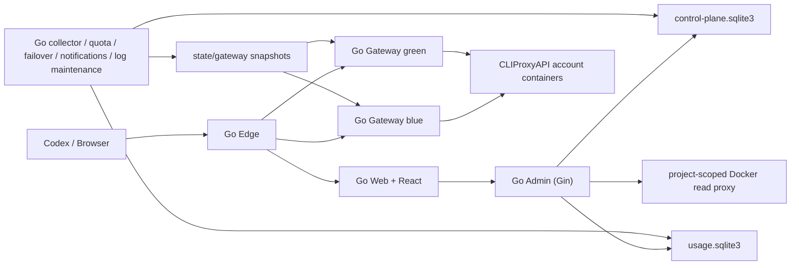
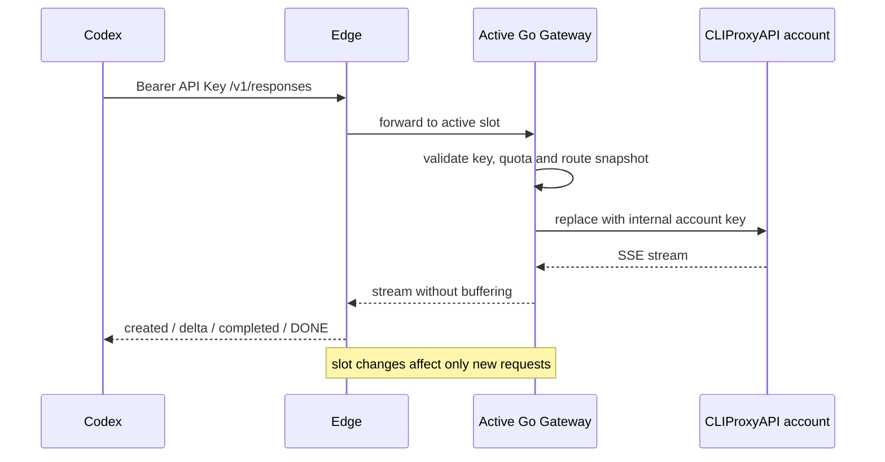

# 架构

## 目标与边界

Codex CPA Cluster 是单机 Docker Compose 部署的 Go 控制面与数据面。它管理多账号 CPA、用户 API Key、额度、用量、Web 页面和发布切换；上游 CLIProxyAPI 账号进程及外部代理不属于本仓库实现。

设计约束：

1. `/v1` 数据面不依赖 Admin 请求是否可用。
2. Edge 始终持有宿主机端口，Gateway 蓝绿切换不重放或中断已经建立的 SSE。
3. 两份 SQLite 和匹配的加密主密钥是既有目标的权威数据，部署不得重新初始化或覆盖。
4. 所有写进程必须持有运行时所有权和各自的 Generation Lease；失去 Lease 后继续写入会被拒绝。

## 运行拓扑



正式 [Compose](../docker-compose.yml) 使用四类镜像：

| 镜像 | 进程 | 责任 |
|---|---|---|
| `control` | Admin、Collector、Quota、Failover、Notifications、Log maintenance、Ownership、Docker read proxy | 控制面 API、SQLite、账号生命周期与后台任务 |
| `web` | Go Web | React Admin、Portal、使用中心静态资源与细粒度 API 代理 |
| `gateway` | 两个 Go Gateway | 外部 Key 鉴权、额度、账号路由、快照热加载和流式转发 |
| `edge` | Go Edge | 稳定端口、Web/数据面分流和蓝绿槽选择 |

## 数据与文件所有权

| 表面 | 所有者 | 说明 |
|---|---|---|
| `state/control-plane.sqlite3` | Go Control | 账号、路由、外部 Key、团队、配置、加密秘密元数据和运行状态 |
| `state/usage.sqlite3` | Go Collector/Portal/Quota | 高频用量事件、用户会话、额度策略和调整账本 |
| `secrets/control-plane.key` | Go Control | 解密控制面秘密的 32 字节主密钥，必须与控制库成对恢复 |
| `auth/<account>/`、`configs/<account>.yaml` | Go 账号生命周期管理器 / 上游账号进程 | OAuth 与上游运行配置，不进入镜像或发布包 |
| `state/gateway/` | Go Collector/Failover | Gateway 只读鉴权、额度和心跳快照 |
| `state/edge/active-gateway.conf` | 发布切换流程 | Edge 当前槽位；非法内容保持最后一个有效槽 |

Admin 的普通运行状态读取经过项目范围 Docker 只读代理。只有最终获批的账号生命周期切换才允许目标环境显式挂载直连 Docker Socket。

## 请求与切换流程



`internal/gateway` 在鉴权快照损坏或过期时失败关闭；上游不可用返回受控 502。`internal/edge` 对非法槽位配置保留最后有效值。对应隔离验证由 `scripts/v2-test-smoke.sh` 和 `scripts/v2-test-faults.sh` 执行。

## 验证入口

```sh
make verify
npm --prefix frontend run test:e2e
make v2-test-build
make v2-test-up
make v2-test-smoke
make v2-test-faults
make v2-test-down
```

真实上线还必须使用同一个真实 API Key 验证 `/v1/models`、非流式 `/v1/responses` 和 SSE；容器健康或隔离 Test 不能替代业务验收。
