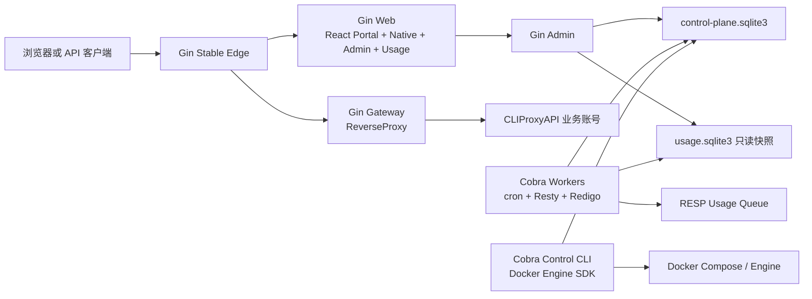

# Go v2 全量迁移与验证矩阵

## 目标与边界

本页是 Go `v2.0.0` 全量迁移的执行清单。最终目标是用 Go/React 替换 Stable Edge、Gateway、
Admin、后台任务、Web、控制 CLI 和发布运行入口，同时保留 Docker Compose、SQLite 与上游
CLIProxyAPI。框架选型与兼容原则由 [ADR 0003](adr/0003-go-migration-framework-stack.md) 管理。

当前 Production 在切换前仍由 OpenResty、Python 和原生 JavaScript 提供服务。`cmd/`、`internal/` 与
`frontend/` 中的 Go v2/React 实现先用于隔离开发与 Test 对比。数据面已有夹具专用的
`docker-compose.v2-test.yml`，目标机已有完整 `docker-compose.v2.yml`、备用回环端口、候选镜像、
数据在线副本/usage v10 迁移和分阶段拉起入口。目标机入口不会修改宿主 Nginx；真实 Writer 所有权与
公网端口只能在旧 Writer 已停止且所有门禁通过后显式切换。

迁移要解决的根本问题不是“把语言换成 Go”，而是让新实现能够在不改变以下外部事实的前提下接管：

- API Key 原始字节、SHA-256 身份映射、用户、账号、路由与额度结果。
- `/v1/responses` 的 SSE/分块响应、请求取消和长连接排空。
- SQLite schema 与历史数据、AES-GCM 主密钥、OAuth 文件、内部 Key 和生成状态。
- Stable Edge 端口、Gateway 蓝绿选择文件、预检、切槽、排空与回滚协议。

任何阶段都不得把同一个真实用户请求复制到 v1/v2。配对请求仅允许由
`cmd/migration-compare` 使用专用测试 Key 和显式测试请求发送。

## 最终模块结构



这是模块化单体：领域逻辑位于 `internal/<domain>`，Gin/Cobra 入口保持轻薄。后台任务可以独立构建和
切换所有权，但不会为“微服务化”增加内部 HTTP、消息总线或分布式事务。

## 框架化边界

| 通用问题 | 统一采用 | 项目代码只保留 |
| --- | --- | --- |
| HTTP 路由与中间件 | Gin | CPA 路径白名单、鉴权/额度决定、安全错误语义 |
| 长连接代理 | `httputil.ReverseProxy` | 上游选择、内部 Key 替换、in-flight 统计 |
| CLI 与启动配置 | Cobra + Viper | 命令前置条件、所有权门禁和回滚编排 |
| 结构化日志 | Zap | 字段白名单与凭据脱敏规则 |
| SQLite | sqlx + modernc SQLite；新 schema 才使用 Goose | 事务边界、期望状态、补偿和数据兼容 |
| 会话 | SCS | 管理/自服务权限与 CSRF 规则 |
| 定时任务 | robfig/cron | 幂等、心跳、单 Writer 所有权和失败语义 |
| 有界异步任务 | Pond v2 | Admin 运维任务状态、去重、冲突与取消语义 |
| 外部 HTTP | Resty | OAuth、额度、Webhook 和版本业务协议 |
| RESP | Redigo | 上游只承诺的 `AUTH`/`LPOP` 命令序列 |
| 文件监听/发布 | fsnotify + renameio | 快照格式、代际与激活确认 |
| API 契约 | OpenAPI 3 + oapi-codegen | 与 v1 对齐后的响应语义和安全约束 |
| Web | React + TypeScript + Vite + React Router + TanStack Query + Ant Design | 页面流程、字段权限和按需刷新策略 |
| 表单与前端测试 | React Hook Form + Zod；Vitest + Testing Library | 领域输入规则和关键交互断言 |
| 容器控制 | Moby API/Client 官方 Go SDK；Compose 仍为交付拓扑 | 精确 Project/Service 标签、账号生命周期、发布前置条件和可恢复编排 |
| 集成环境 | 独立 Docker Compose | v1/v2 契约、故障与回滚场景；不为已有 Compose 能覆盖的场景重复引入 Testcontainers |

不引入 GORM AutoMigrate、依赖注入容器或迁移期微服务拆分。它们不能降低当前最主要的 SQLite 接管、
跨进程所有权和数据面切换风险，反而会增加隐式行为。

## 跨版本单 Writer 所有权

Go 与过渡期 Python v1 共享 `runtime_state` 中同一份版本化 Lease 协议。运行时总闸为
`runtime-writer`，进程级排他 Scope 为 `admin`、`usage-collector`、`quota`、
`account-failover`、`notifications` 和 `log-maintenance`。每条 Lease 同时使用随机 Token 与单调递增
Generation 做 fencing；过期实例不能续约或释放新一代 Lease，损坏状态一律 fail-closed。

- `cmd/ownership` 使用 Cobra/Viper 提供只读状态、显式激活和精确代际释放；输出永不包含 Token。
- 接管已有所有权时，激活命令必须同时匹配已过期前任的 Owner 和 Generation；只知道 Owner 不足以
  排除操作者读取了陈旧状态。
- 所有 Go 可变更入口先通过 `controlplane.OpenExisting` 打开既有目标，只允许写 Lease；取得运行时和
  Worker 两层所有权后，才执行 schema 校验/迁移、秘密兼容和业务初始化。
- `admin/server.py`、`admin/usage_collector.py` 和 `admin/log_maintenance.py` 使用
  `scripts/ownership_lease.py` 的同协议 Guard。Python Admin 同时保留其内嵌 quota、failover 和
  notifications Scope；Lease 丢失时直接终止进程，依赖 SQLite 原子事务恢复，拒绝继续处理写请求。
- 健康检查使用 query-only 连接，不创建目标、不申请 Lease。Gateway/Edge 数据面也不依赖 Writer
  Lease，因此所有权切换失败不会中断已有 API Key/Codex 转发。
- `runtime-writer` 只能由显式切换命令激活；普通 Worker 只能 Join，不能在空目标上自行成为 Writer。
- Go 取得 runtime/worker 两层 Lease 后会把 Token 与 Generation 安装为 Store 写栅栏；每个控制面
  写事务在同一个 `BEGIN` 与跨进程文件锁内核对两层 Lease，陈旧进程不能利用心跳检测窗口提交写入。
- 同一栅栏也覆盖 `usage.sqlite3` 的 Collector/Admin 写入、鉴权与额度快照、额度 heartbeat、日志轮转、
  failover 审计和非幂等 Webhook 发送。外部副作用只在核对代际后执行；Gateway 激活等待和通知状态
  落库放在栅栏外，避免嵌套获取控制面锁。

当前代码、精确代际 CLI、Go 事务/外部副作用 fencing 和临时根目录的 Python v1→Go v2→Python v1
跨语言回滚演练已完成。`make v2-worker-lease-rehearsal` 还会同时启动六个 Go Worker Scope，验证它们
共享 runtime 所有权、拒绝同 Scope 重复实例、独立释放，并在逻辑 TTL 后让 runtime 与六个 Scope
一起推进到回滚第 2 代。`make v2-worker-process-rehearsal` 会在另一个一次性 Test 根目录构建并启动六个
真实 Cobra 命令，验证重复 Admin 拒绝、Collector 被强制终止后在旧代际到期前不能重启、重启后只把
Collector Scope 推进到第 2 代、耐久 checkpoint 不变，以及 Python v1 恢复 runtime 第 2 代和各 Worker
后续代际。目标机入口把核心服务、普通 Writer 和具有外部副作用的通知 Worker 分成三个显式阶段，
且在启动任何可写服务前验证 `runtime-writer` 所有权。

## 实现与缺口矩阵

| 领域 | 当前 Go v2 证据 | 尚未完成 | 进入下一阶段的门禁 |
| --- | --- | --- | --- |
| Gateway | `cmd/gateway`、`internal/gateway`、共享契约夹具；隔离故障测试覆盖上游 502、快照 503 与恢复 | Test 实例的取消、压力、429 和更多故障对比 | 401/404/429/503、模型路由、SSE、取消、日志隐私全部一致 |
| Stable Edge | `cmd/edge`、`internal/edge`、v2 Edge 候选镜像、隔离 Test Compose 和目标机备用端口 Compose；故障脚本验证无效选择保留、蓝绿新请求切换及旧 SSE 排空；并行目标已验证独立 HTTP 入口只指向 v2、原 HTTPS v1 数据面不重启 | 正式入口切换/回切演练；chunked 413 压力 | 新请求切槽、旧流排空、chunked 413、Header 与内部边界验证通过 |
| Admin 核心 | `cmd/admin`、`internal/admin`、`internal/accountlifecycle`、`internal/portal`、`internal/runtimeops`；Gin 已提供细粒度 API，账号创建/修改/重命名/停用/OAuth 清理/删除具备 SQLite Journal、补偿、Moby 探针、Gateway 激活确认和 in-flight 排空；Logo、管理密钥轮换、CPA 镜像状态、停止影响预检及兼容 `exit_code` 的有界日志均有专用接口 | 隔离根目录进程中断演练和正式发布回滚入口 | 每个写操作具备期望状态、补偿、快照激活确认和审计；恢复路径不得绕过排空 |
| 用户/团队/额度 | `internal/controlplane`、`internal/identity`、`internal/usage`、React Users/Teams；账号 `since_reset` 从官方额度运行态读取真实周期边界，缺失时 fail-closed | 双版本复制数据库差异与并发失败测试 | Key 字节/摘要、历史用量、团队归属和自然周额度摘要一致 |
| 标签 | Go 不注册标签 API 或页面；仅保留旧 schema 表以兼容 v1 | 最终退役 v1 后再决定是否删除旧表 | 不把旧表存在误写为已启用功能 |
| 账号均衡/自动切换 | `internal/failover`、`cmd/failover`、React Accounts；仅 `off/active`；跨语言 Lease 已接入 | Test 长时运行、所有权转移与回滚演练 | 整批失败不写路由；成功后立即刷新 1h 活跃数 |
| Usage Collector | `internal/collector`、`cmd/collector`；用量库写入、quota snapshot 和 heartbeat 均受精确代际栅栏保护；积压夹具覆盖已提交批次保守重放，真实进程演练覆盖强制终止/过期/重启 | 独立队列的 v1/v2 确定性数据差异 | 同一队列始终只有一个消费者；schema v10 摘要一致 |
| Quota/Notifications/Logs | `cmd/quota`、`cmd/notifications`、`cmd/log-maintenance`、领域包及跨版本 Worker Lease；Webhook、轮转和 failover 审计均已 fencing；独立通知测试接口只发送通道测试文本，不采集或伪装成正式额度报告 | 测试 OAuth/Webhook/日志副本的长时对比与所有权移交演练 | 不重复轮询真实 OAuth、不重复发真实 Webhook、不并行轮转同一日志 |
| React Web | `cmd/web`、`internal/web`、`frontend/` 的 Portal/Native/Admin/Usage 构建和纯 Go v2 Web 候选镜像；账号页完成账号生命周期和全账号均衡；通用设置完成 Logo 上传/恢复、管理密钥轮换后重新登录；运行页展示 CPA 镜像并在停止前强制读取影响；通知页区分额度报告和测试消息；版本检查保持显式按需请求 | 桌面/窄屏可访问性验收和 Production Web 切换 | 静态路径与 CSP/缓存边界、Native URL 双层白名单、细粒度 API 按需请求、Key 不持久化、页面/构建/可访问性检查通过 |
| 控制 CLI/容器管理 | `internal/runtimeops` 已用 Moby SDK 完成精确 Compose 服务目录、受限启停/重启、2 MiB 脱敏日志、Pond 有界任务和账号容器创建/重建/删除；不允许 Admin 停止 Edge/Gateway/Admin | Cobra render/apply、镜像与发布回滚、隔离根目录真实 Docker 生命周期演练 | 复制根目录演练和现有 Python 行为差异为零 |
| 镜像/Compose/发布 | `v2/Dockerfile` 多阶段镜像、隔离 Test Compose、完整目标机 Compose、四个独立 v2 候选组件指纹与 `deploy-v2-target.sh` 拉取/标签校验/分阶段启动；正式切换前仍为 v1 | 目标机现场恢复与宿主入口切换验收 | 镜像内容指纹、数据保护、切槽确认、回滚演练全部通过 |
| 配对验证 | `cmd/migration-compare`、`internal/migrationcheck` | 在隔离 Test 上执行并归档脱敏结果 | 只使用 0600 专用测试 Key；默认只接受 loopback；不输出 Key/请求正文 |

### Admin 读取结构差异决策

`scripts/migration-admin-read-compare.py` 不是按接口名忽略差异，而是核对下表的精确字段增删集合；
任何未列字段、嵌套数组字段变化或新的差异接口都会失败。相同结构始终直接通过。

| 接口对比项 | 允许的精确方向 | 原因 |
| --- | --- | --- |
| `session` | v1 独有内嵌 `accounts` | v2 登录后按需请求账号目录 |
| `accounts` | v2 仅保留轻量目录及 `warnings`；v1 聚合额度、用量、运行态 | 账号页通过细粒度接口按需加载 |
| `logs` | 两版都有 `exit_code`；v2 额外 `truncated` | Go 日志读取有 2 MiB 明确上限 |
| `overview_usage` | v2 额外 `cached` | 明确返回 `false`，不使用响应缓存 |
| `teams` | v1 独有 `tags` | 产品确认移除标签管理 |
| `users` | v2 分页且使用轻量用户行；v1 聚合账号、额度、用量和标签 | 用户详情只在打开抽屉时加载 |

### Admin 可逆写入差异决策

`scripts/migration-admin-write-compare.py` 只在两份带隔离标记且 inode 不同的数据副本上运行，
使用会话与 CSRF 完成团队创建、重复名冲突、更新、读回、删除、删除后读回，以及用户额度无效值校验。
团队在成功或异常退出时都会删除；脚本不调用账号容器生命周期、通知、OAuth 或真实外部副作用。

| 对比步骤 | 允许的精确方向 | 原因 |
| --- | --- | --- |
| Admin 登录 | v1 返回内嵌 `accounts`；v2 不返回 | v2 登录后按需请求细粒度账号目录 |
| 团队读回、删除后读回 | v1 返回 `teams` 与旧 `tags`；v2 仅返回 `teams` | 产品确认移除标签管理 |
| 重复团队名 | v1 `400 invalid_request`；v2 `409 team_name_conflict` | v2 为 React 表单提供精确冲突语义 |

除上表外，状态码、错误码、Content-Type 或顶层字段出现任何变化都视为未迁移完成并让现场对比失败。

## 验证与切换顺序

| Gate | 环境与动作 | 必须通过 | 失败处理 |
| --- | --- | --- | --- |
| G0 单元/契约 | 本地夹具与 mock | `make verify`，含 Go race、React、Lua、Python、Compose、隐私检查 | 不进入集成环境 |
| G0.5 隔离数据面 | `codex-cpa-v2-test` 独立 Compose 项目、内部后端网络、仅 Edge 回环端口 | `make v2-test-build && make v2-test-up && make v2-test-smoke`；结束后 `make v2-test-down` | 不启动配对 v1，不切任何 Writer |
| G1 数据副本差异 | 两份同源 SQLite/状态副本、独立队列 | 数据摘要、路由计划、配额、通知状态和写后状态一致 | 丢弃副本并修复，Production 不变 |
| G2 双版本 Test | `docker-compose.v1-compare.yml` 的最新版主分支 v1 与 Go v2 使用不同端口、不同写入副本、专用测试 Key；两边 Gateway 共用同一组带 `migration-disposable` 标签的隔离 CPA 上游，v1 不启动 Worker且 Admin 仅使用限制到该 disposable Compose 项目的只读 Docker 代理 | `cmd/migration-compare` 的健康、404、401、模型摘要、快照代际和可选 SSE 全通过 | 两版保持隔离，不切任何所有权；禁止连接 Production CPA 网络 |
| G3 压力/故障 | Test 流量、SQLite busy、损坏/陈旧快照、上游断连、Worker/进程重启 | `make verify` 已覆盖控制/用量 SQLite busy 恢复和队列积压重放；`make v2-test-faults` 覆盖上游/鉴权快照/Edge/SSE；`make v2-worker-process-rehearsal` 覆盖真实 Collector 强制终止/过期/重启；仍需独立 v1/v2 队列确定性差异和长时压力 | 重新从 G0 开始相关领域验证 |
| G4 切换/回滚演练 | Test Stable Edge + 蓝绿 Gateway + Writer Lease | `make v2-lease-rehearsal` 覆盖跨语言代际与陈旧写入；`make v2-worker-lease-rehearsal` 覆盖六 Scope 组；`make v2-worker-process-rehearsal` 覆盖真实命令、checkpoint 和 Python v1 回滚代际；`deploy-v2-target.sh` 固化目标机分阶段顺序 | Edge 先回旧槽，v2 Writer 全停，v1 恢复唯一 Writer |
| G5 Production 一次切换 | 已批准窗口；v1 热备只读 | 公网专用验收、数据摘要、API Key/模型/流式、Worker 心跳全部通过 | 立即回切 v1，v2 停止写入，保留证据 |
| G6 Soak | v2 主用，v1 warm/read-only | 预定观察期内无契约、数据或性能回归 | 回切 v1；不得删除兼容代码 |

最终切换只有一次，但之前必须完成共存验证与回滚演练。v1 只有在 Soak 结束、备份恢复再次验证并获得
明确清理授权后才能移除。

## 配对验证命令

独立故障与 Lease 回滚基线：

```bash
make v2-test-faults
make v2-lease-rehearsal
make v2-worker-lease-rehearsal
make v2-worker-process-rehearsal
```

四条命令都创建自己的临时状态，不读取 Production SQLite、OAuth、Webhook 或真实队列。

复制状态的 G1/G4 对比使用 Cobra 子命令输出只含表行数和单向摘要的报告。耐久门禁包含控制/用量
schema、账号、原始 Key 字节的组合摘要、路由、团队、历史事件、额度策略以及鉴权/额度快照语义；
Lease、Worker heartbeat 和 Portal session 作为单独的 operational difference，不会被误当成耐久数据漂移：

```bash
go run ./cmd/migration-compare state \
  --v1-root /path/to/isolated-v1-copy \
  --v2-root /path/to/isolated-v2-copy \
  --confirm-isolated-state-copies
```

Key 文件必须只含一条专用 Test API Key、权限为 `0600`，命令不会输出 Key 或请求正文。默认只允许
loopback Origin；远程 Test 需要显式允许。

```bash
go run ./cmd/migration-compare \
  --v1-public-url http://127.0.0.1:18317 \
  --v2-public-url http://127.0.0.1:28317 \
  --v1-internal-url http://127.0.0.1:18316 \
  --v2-internal-url http://127.0.0.1:28319 \
  --test-key-file /path/to/test-only.key \
  --confirm-dedicated-test-key
```

需要验证 `/v1/responses` 时，额外传入权限受控、明确包含 `"stream": true` 的非生产 JSON 请求夹具：

```bash
go run ./cmd/migration-compare \
  --v1-public-url http://127.0.0.1:18317 \
  --v2-public-url http://127.0.0.1:28317 \
  --test-key-file /path/to/test-only.key \
  --stream-request-file /path/to/test-stream-request.json \
  --confirm-dedicated-test-key
```

命令顺序向两个 Test Origin 各发送一次显式测试请求，不镜像在线请求。报告只含状态、错误类型/代码、
模型响应规范化摘要、快照代际和 SSE 事件类型序列。

## 维护清单

- 路由或错误契约变化：同步 `testdata/gateway/contracts.json`、Go/Lua/Python 契约测试和 ADR 0003。
- 新增 Go API：先对齐旧契约，再更新 OpenAPI、生成类型、React API 客户端与权限测试。
- 新增 SQLite schema：使用 Goose 可审查 migration；接管既有库时仍先做精确版本校验。
- 接入镜像或 Compose：同步发布组件指纹、数据保护、健康检查、切槽确认与回滚测试。
- 任何 Writer/Worker 切换：证明旧实例已失去 Lease 后，新实例才能写入或消费。
- 完成一项矩阵能力后，同时更新本页、`docs/development.md` 和本机 `.harness/` 索引。

账号生命周期改动还必须运行 `go test -race ./internal/accountlifecycle ./internal/runtimeops ./internal/admin`，
并验证以下不变量：备用账号已启用且额度可用、迁移快照已被全部 Gateway 激活、旧账号 in-flight 为零后
才重建、删除或在清理 OAuth 后重启容器、失败后路由/文件/容器/SQLite/代理密文全部恢复、API Key 原始字节与摘要不变。OpenAPI 的
`account_requests_active` 与 `account_lifecycle_not_ready` 不能退化为未说明的 `500`。

## 已知陷阱

- “页面实时请求”不能替代 SQLite 事务、唯一约束、WAL 和跨进程所有权。
- 企业微信没有幂等键；栅栏可以阻止所有权转移后的旧 Worker 发送，但进程若在远端成功、状态落库前
  崩溃，仍保留至少一次语义。Test 必须验证这一边界，不能宣称绝对不重复。
- CLIProxyAPI Usage Queue 当前只承诺破坏性 `LPOP`，没有 ACK/NACK。积压重启测试证明已提交批次的
  确定性去重与保守重放，不宣称能恢复“LPOP 已返回但 SQLite 尚未提交”时崩溃丢失的批次；Writer
  切换必须先停旧 Collector、确认进程退出和 checkpoint，再让新 Collector 消费独立队列。
- chunked 请求在超过 Edge 上限前可能已向上游发送前缀；兼容目标是稳定返回 `413`，不是通过内存缓冲
  整个 100 MiB 请求来隐藏流式语义。
- 选择文件已写入不代表 Edge 已加载；切流验收必须读取 Go Edge 的
  `/__internal/edge/slot` 或当前 OpenResty 的等价加载确认后再探测活动 Gateway。
- `tags`/`user_tags` 表是 v1 数据兼容面，不代表 Go v2 提供标签管理。
- 代码完成、单元测试通过或镜像构建成功都不等于获得 Production 写入或端口所有权。
